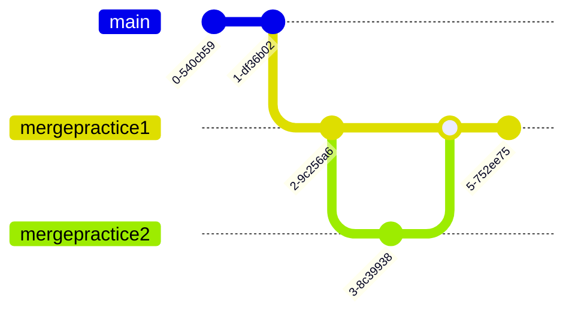

# Git workshop med Eik

Øvelse gjør mester.

Dette repoet er strukturert slik at hver eneste branch(gren) har en hensikt.

For.eks vil er hensikten med mergepractice1 og mergepractice2 å gi dere erfaring med det å kombinere branchene sammen.

Dette repoet tar utgangspunk i to ting:
1. At du har git installert på PC-en. Du kan installere det [herifra](https://git-scm.com)
2. At du har [VSCode] installert på pcen. Du kan installere det [herifra](https://code.visualstudio.com)

## Skritt 0: Lag en github bruker
* Gå til [Github](https://github.com).
* Lag en bruker og log inn på github.
* Pass på at du kan kommunisere med Github på PC-en din. Følg [denne guiden her](https://docs.github.com/en/authentication/connecting-to-github-with-ssh)
* På høyre siden av skjermen deres skal dere se en grønn knapp som sier `New`. Klikk på den.
* Gi det repoet et navn. For.eks `Learning git`
* Pass på at `Initialize this repository with a README` IKKE er huket av.

## Skritt 1: Sette opp github repoet på PC-en.

