# Git workshop med Eik

Øvelse gjør mester.

Dette repoet er strukturert slik at hver eneste branch(gren) har en hensikt.

For.eks er hensikten med mergepractice1 og mergepractice2 å gi dere erfaring med det å kombinere branchene sammen. Mer om dette kommer senere

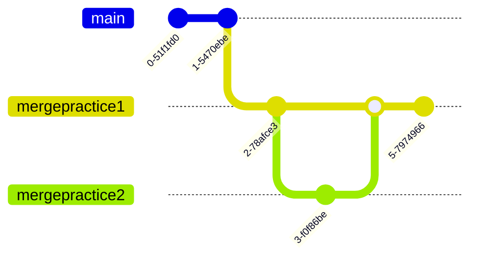
```mermaid
  gitGraph
       commit
       commit
       branch mergepractice1
       checkout mergepractice1
       commit
       branch mergepractice2
       checkout mergepractice2
       commit
       checkout mergepractice1
       merge mergepractice2
       commit
```

Dette repoet tar utgangspunk i to ting:

1. At du har git installert på PC-en. Du kan installere det [herifra](https://git-scm.com)
2. At du har [VSCode] installert på pcen. Du kan installere det [herifra](https://code.visualstudio.com)


## Skritt -$\infin$
### Hvorfor skal jeg bry meg om git?
Git er bransje standard når det kommer til å holde styr over kode, 
jobbe sammen med kode. Om man jobber med datavitenskap, bioinformatikk, cybersecurity, eller kun med kode, så er man bort i git.
Men git er så mye mer enn kun for kode. For.eks er det en fin måte å bygge en CV på 
hvis man jobber med hardware design, 3D design, osv osv. 

## Skritt -1: Sette opp git!

- Først, sett opp en SSH nøkkel for git.
  - <details>
        <summary> Hva er SSH? </summary>
        SSH står for ` Secure SHell protocoll`. Dette er en måte å kommunisere på over internett, uavhengig av om nettverket du er på er sikkert. 
    </details>
  - For å sette opp git, følg denne guiden her: https://docs.github.com/en/authentication/connecting-to-github-with-ssh

* Sett opp en git identitet:
  Kjør commandoene:

```
git config --global user.name "your name"
git config --global user.email "your.name@domain.com"
```

For.eks så bruker jeg([uzaaft](https://github.com/Uzaaft)):

```
git config --global user.name "uzaaft"
git config --global user.email "muaf@nmbu.no"
```

## Skritt 0: Lag en [github](https://github.com) bruker, og et repo

- Gå til [Github](https://github.com).
- Lag en bruker og log inn på github. Vi anbefaler dere å bruke NMBU mailen! Da får dere goodies fra github(gratis kurs, etc)
- Pass på at du kan kommunisere med Github på PC-en din. Følg [denne guiden her](https://docs.github.com/en/authentication/connecting-to-github-with-ssh)
- På høyre siden av skjermen deres skal dere se en grønn knapp som sier `New`. Klikk på den.
- Gi det repoet et navn. For.eks `Learning git`
- Pass på at `Initialize this repository with a README` IKKE er huket av.

## Skritt 0.5: Hvorfor [Github](https://github.com)

[Github](https://github.com) er en av de mest brukte nettsidene av utviklere. Github er et "Version Control Service"

## Skritt 1: Sette opp github repoet på PC-en.

- Opprett en mappe kalt `mittProsjekt`.
- Gå inn i den mappen i VSCode.

* Trykk på `CTRL+SHIFT+P` og søk etter terminalen(skriv `create new terminal` i søkefeltet)

- I terminalvinduet, gå til mappen du lagde(Hvis den ikke åpner opp i samme mappe)[Hvorfor terminalen?](https://github.com/Uzaaft/git_workshop/blob/main/Hvorfor_terminalen.md)
- Kjør `git init`.
  - <details>
    <summary> Hva skjedde nå? </summary>
    <br />
    Du har nettopp fortalt datamaskinen din at du vil at git skal se på `myProject`-mappen og holde styr på eventuelle endringer. Dette lar oss også kjøre git-kommandoer inne i mappen. (Advarsel: Vær veldig forsiktig med å sørge for at du er i riktig katalog når du kjører `git init`!)
    </details>
- Kjør git remote add origin [SETT INN GITHUB URL-en INN HER]. Du kan få URL-en din ved å gå til repotet du har laget tidligere i nettleseren din og kopiere adressen. Se bilde under for eksempel.
  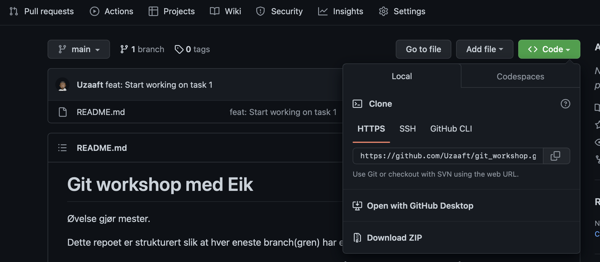
  <br/>
  - <details>
    <summary>Hva skjedde nå? </summary>
    <br/>
    I utgangspunktet forteller vi datamaskinen vår "Hei, jeg opprettet denne repoen på GitHub, så når jeg 'pusher', vil jeg at koden min skal gå til denne adressen." Nå hver gang du kjører `git push origin master`, vet datamaskinen din at origin peker på repoen du har laget på GitHub, og den skyver endringene dine dit.
    <br/>
    (Hvis du ved et uhell initialiserte repoet ditt med en README, må du gjøre en git pull origin master først - for å få README-filen på datamaskinen din - før du kan trykke. )
    </details>

## Skritt 2: Legge til filer

Vi skal nå legge til en fil, og sende/lagre den til Github.

- Først, lag en fil i VSCode som heter README.md
- Skriv navnet ditt i filen.
- Gå inn i terminalen din, og kjør kommandoen under, der `FILNAVN er navnet på filen`:

```bash
git add <FILNAVN>
```

- Hva tror dere skjedde nå?

## Skritt 2.5: Beskrive hva vi har gjort.

Når man bruker git, og eventuelle nettsider for å håndtere Git([Github](www.github.com), [Gitlab](www.gitlab.com), [Bitbucket](https://bitbucket.org/) ), så burde man anta at noen andre kommer til å se koden din, og loggen over endringer man har gjort. For eksempel ser en git graf fra Njord Technologies sånn ut:

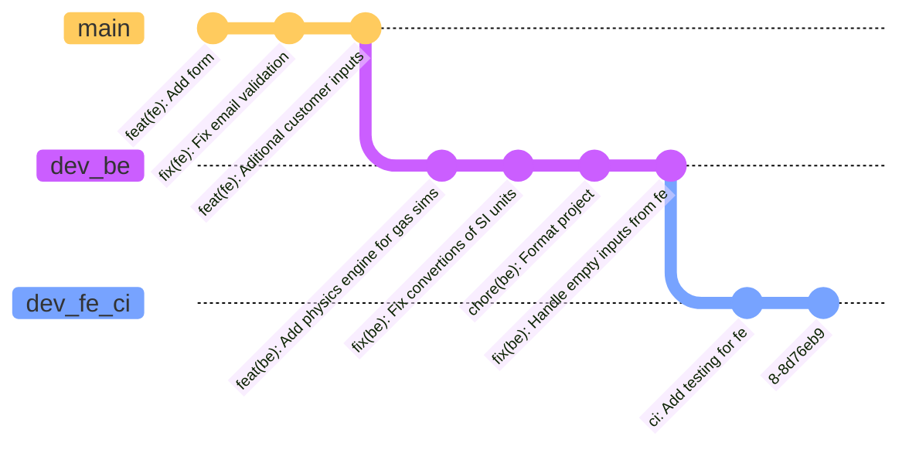
```mermaid
%%{init: { 'logLevel': 'debug', 'theme': 'base', 'gitGraph': {'rotateCommitLabel': true}} }%%
gitGraph
  commit id: "feat(fe): Add form"
  commit id: "fix(fe): Fix email validation"
  commit id: "feat(fe): Aditional customer inputs"
  branch dev_be
  commit id: "feat(be): Add physics engine for gas sims"
  commit id: "fix(be): Fix convertions of SI units"
  commit id: "chore(be): Format project"
  commit id: "fix(be): Handle empty inputs from fe"
  branch dev_fe_ci
  commit id: "ci: Add testing for fe"
  commit
```

Her ser man en oversiktlig og fin graf der hver eneste commit(See på commit som et lagrings punkt, eller checkpoint).
Hver commit har en commit-melding, som er et liten tekst som forklarer hva commiten består av. En standarisert måte å skrive disse meldingene på kan [finnes her](https://www.conventionalcommits.org/en/v1.0.0/), men under finner du en TL;DR:
Endringene som en commit beskriver kan gruppes i for.eks:

- fix: En commit av typen `fix` som retter på en feil i koden/prosjektet.
- feat: En commit av typen `feat` som legger til en ny egenskap/feature i koden/prosjektet.
- BREAKING CHANGE, eller fix!/feat!: En commit som endrer på koden ved å enten rette på noe, eller legger til en ny egenskap/feature, og som fører ikke er bakover compatibel.

## Skritt 3: La oss commite en endring til Git!

La oss nå commite endringne vi har gjort.
En commit er et.lagringspunkt/checkpoint i koden. Når vi commiter sier vi: git, nå vil jeg lagre disse endringene som jeg har gjort, med følgende melding.  
Husk, bruk det vi snakket om i Skritt 2.5 for å skrive commit meldingen!
I terminalen, kjør kommandoen:

```
git commit -m "MELDING HER"
```

der `flagget` -m står får message

  <br/>
   <details>
    <summary>Hva skjedde nå? </summary>
    <br/>
    Vi lagret endringen vi har gjort, med en melding i git. Hvis vi skriver: `git log` kan vi se endringene som er lagret.
    </details>

## Skritt 3.5: La oss se loggen vår med commits

Ofte er det nyttig å se en log over commits som har blitt gjort. For å få denne oversikten, kjør:

```
git log
```

Diskuter med hverandre. Hva viser loggen?

## Skritt 4:

La oss pushe endringene til git, slik at vi har en backup av det vi har gjort.
For å sende endringene opp til github, kjør:

```
git push
```

## Skritt 4.9:

Gjerne gjør et par endringer, og commit på nytt. 🤓

## Skritt 5: Git og Github

Nå som vi jobba litt med basic git commandoer, la oss jobbe med et faktis repo!

Først, la oss forke repoet som du ser på. Når vi forker, så lager vi en egen kopi av et repo.
Først, gå helt opp, og trykk på fork knappen. 
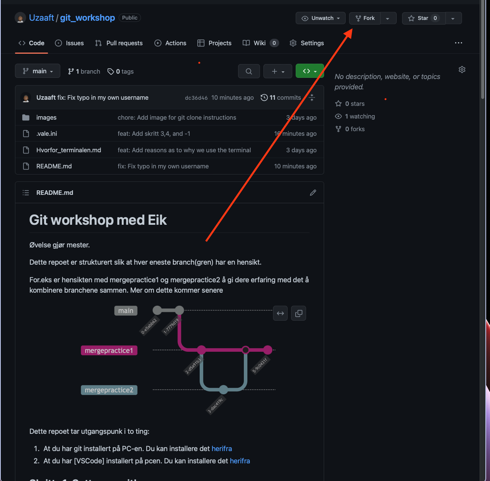
I neste skjerm, pass på at knappen `Copy the main branch only` ikke er huket av. Dette gjelder kun for dette repoet her. Hver eneste gang man forker er litt unik, så bruk hodet neste gang dere forker. 🤓
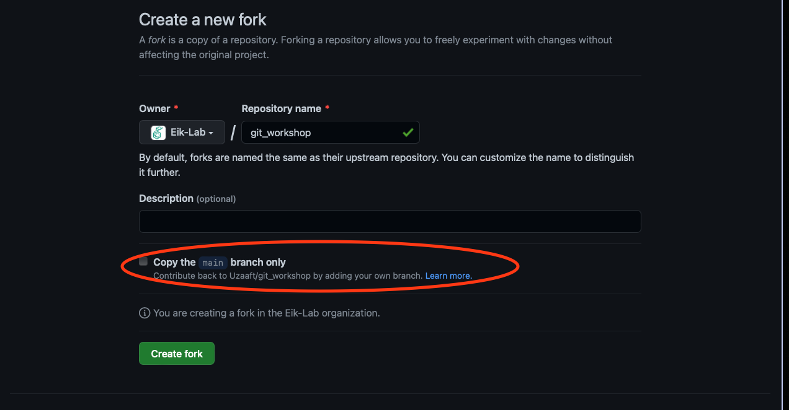

Kopier linken til repoet ved å trykke på den grønne knappen(se bildet under). I vinduet som popper frem, pass på at dere har valgt ssh linken(se bildet under).
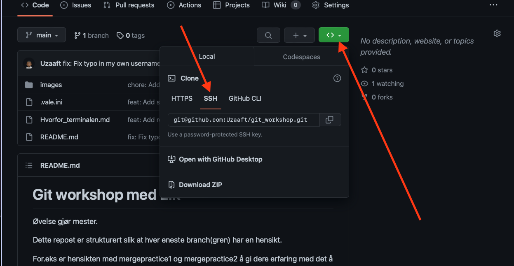
Klikk på ikonet ved siden av linken. Du har nå kopiert linken til repoet. 

Gå inn på vscode, og trykk på `Clone Git Repository...`
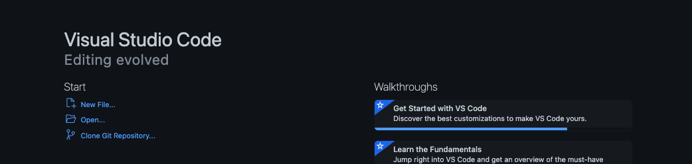

Lim inn linken til repoet. VSCode vil nå åpne opp et vindu med din fork av dette repoet her. 🤯

## Skritt 6: Branches
Vi skal nå jobbe med grener.
Hva er en git gren?
En gren er en linje av commits. Hver eneste commit har en forrige commit, og en neste commit. Hvis vi ser på et repo som en graf, så er en gren en linje av commits. Hensikten med en branch er å kunne jobbe med ulike versjoner av koden samtidig. Hvis vi for eksempel skal jobbe med en ny feature, så kan vi jobbe med denne featuren i en egen gren, uten å påvirke noe annet. Når featuren er ferdig, kan vi merge inn featuren i master branchen.  
Oisann, der kom et nytt ord. Hva er en merge?

En merge er når vi tar en gren, og legger den inn i en annen gren. Når vi merger en gren inn i en annen gren, så vil alle commitsene i den første grenen bli lagt til i den andre grenen.  

Se diagrammet under for en illustrasjon av dette.
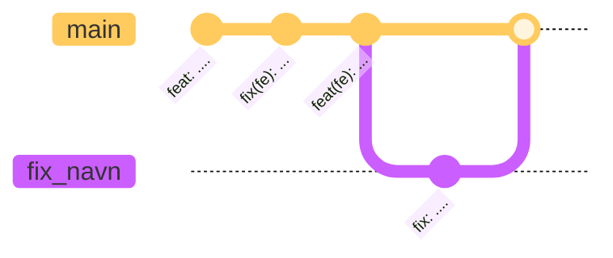
```mermaid
%%{init: { 'logLevel': 'debug', 'theme': 'base', 'gitGraph': {'rotateCommitLabel': true}} }%%
gitGraph
  commit id: "feat: ...."
  commit id: "fix(fe): ..."
  commit id: "feat(fe): ..."
  branch fix_navn
  commit id: "fix: ...."
  checkout main
  merge fix_navn
```

La oss nå gjøre det diagrammet viser.


## Skritt 7: Lag en branch
For å lage en branch, og bytte over til den branchen, kjør kommandoen:

```
git checkout -b fix_navn
```
 Deretter, må vi korrigere linja under.

 ```python
 name = eik
```
Bytt ut eik med navnet ditt.

For å bytte tilbake til original branchen vår, kjør:
```
git checkout main
```
Se på linjen du endra på. Ser du at vi nå er tilbake til det gamle navnet? La oss fikse dette også i main branchen!
Men først, commit, og push endringene dine til github.

## Skritt 8: Merging
La oss nå merge endringene fra skritt 7 inn i `main` branchen.
Kjør:
```
git merge <NAVNET_PÅ_BRANCHEN_DU_VIL_MERGE
```
Hva skjer når du kjører denne kommandoen? Prøv å tolk det du får opp i terminalen. Sjekk også 
```
git log 
```

Så er det bare å pushe endringene til Github 🤓.

## Skritt 9: Pull requests
Det finnes flere måter å merge på. I skritt 8 så brukte vi `merge` kommandoen til å merge. Men Github har også en måte å merge gjennom nettsiden,og det er gjennom `pull requests`. 
Når vi lager en pull request, så lager vi en forespørsel om å merge en branch inn i en annen branch. Det er veldig vanlig å bruke pull requests i selskaper. Dette er fordi det blir enklere å se endringene som er gjort, og det blir enklere å diskutere endringene som er gjort. Så la oss nå teste ut Pull requests i Github:

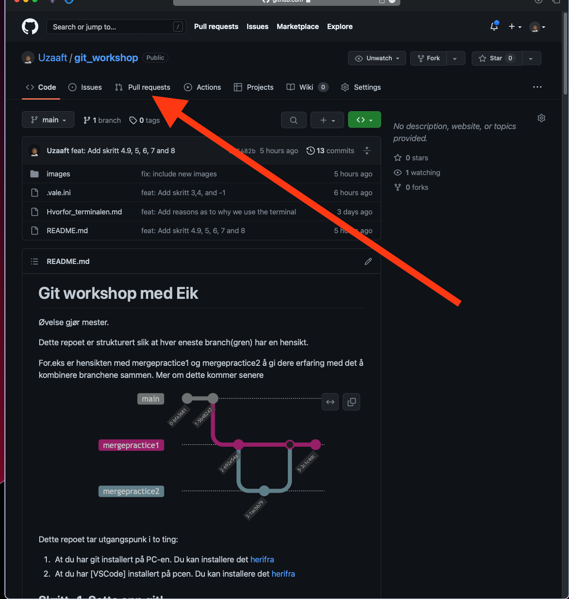

Trykk på `New pull request` knappen.


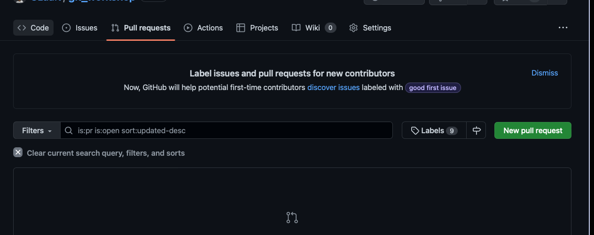
 Du vil nå se en side som ser slik ut:
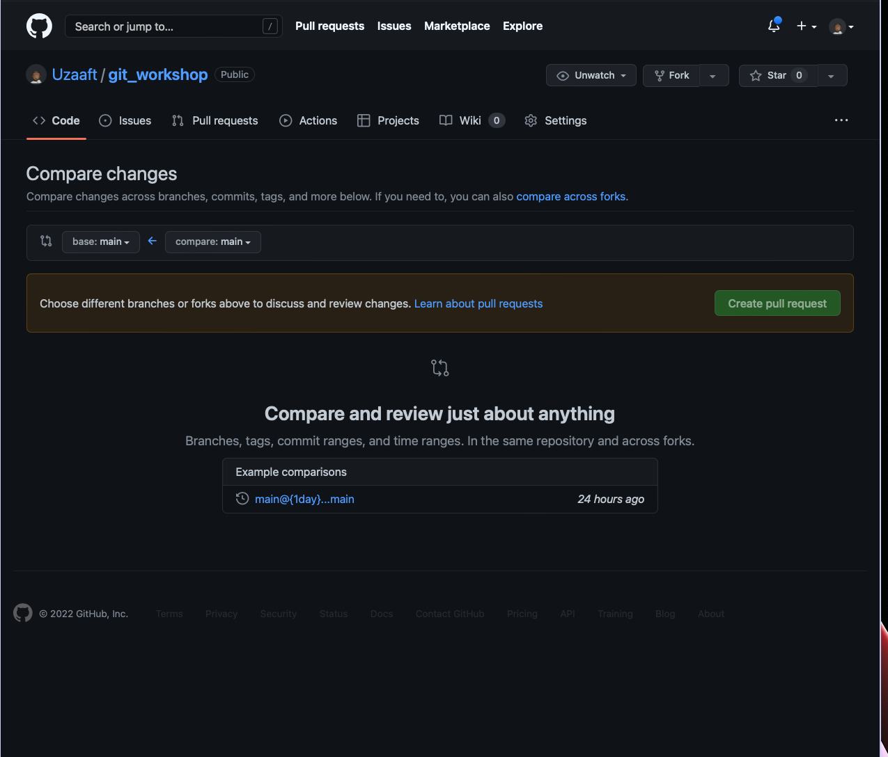
Først, så må du felge riktig branches for pull requesten.
 HUSK: Vi vil merge fix_navn inn i main

 Deretter trykk på Create pull request.


Her kan du skrive en melding om hva du har gjort. I tillegg, kan du se hvilke commits som er med i denne pull requesten. Hvis du trykker på `Files changed`, så kan du se hvilke filer som er endret i denne pull requesten. 

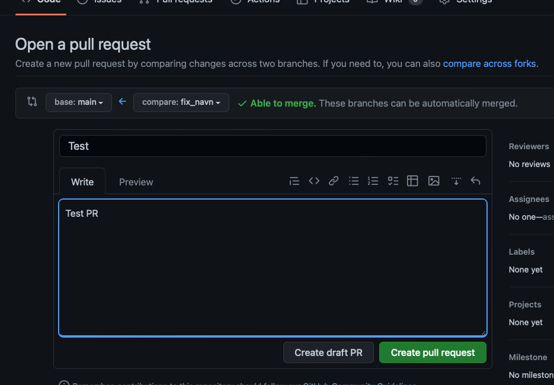

Når du er ferdig, trykk på `Create pull request` knappen. Du vil nå se en side som ser slik ut:
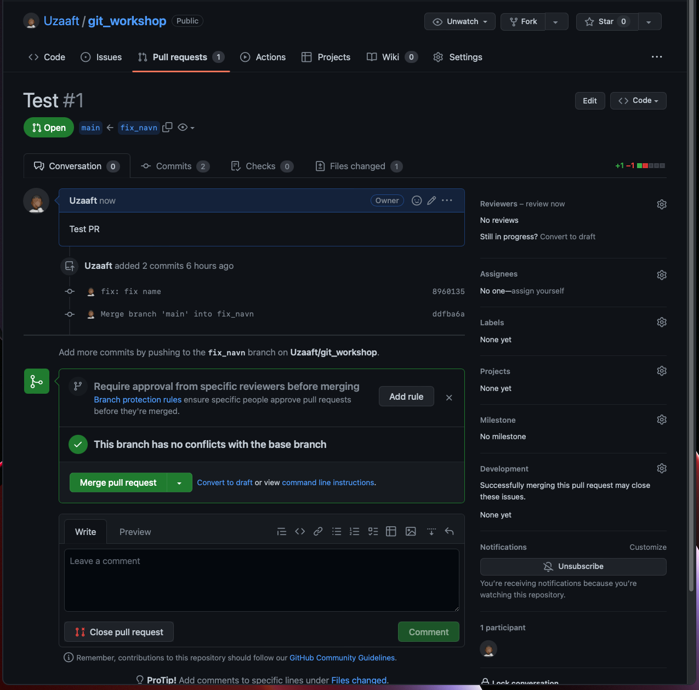

Her kan du se at pull requesten din er laget. Her kan du også se hvilke commits som er med i denne pull requesten. Du kan også se hvilke filer som er endret i denne pull requesten. 

Du kan også se at det er en knapp som heter `Merge pull request`. Trykk på denne knappen. Hva skjer nå?

 Når du er ferdig, trykk på `Confirm merge` knappen. Du vil nå se en side som ser slik ut:
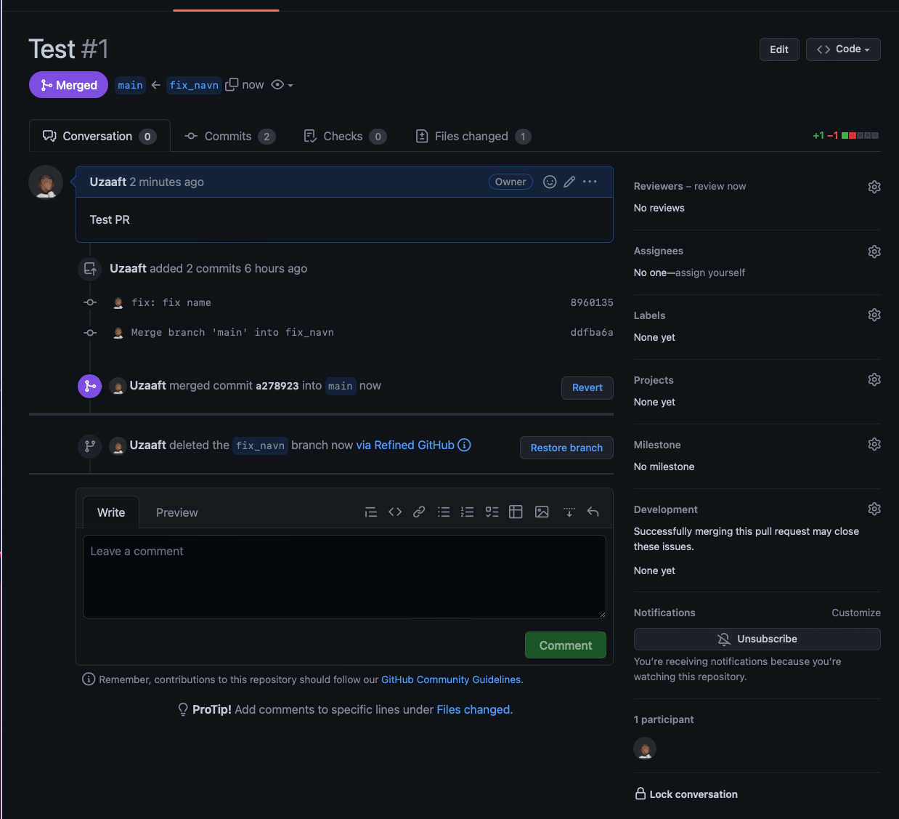

Her kan du se at pull requesten din er merget. Du vil også se at den er merget i main branchen. Du kan nå slette branchen din.


# Skritt 10: [Merge conflicts](https://www.youtube.com/watch?v=cphNpqKpKc4)

En hver programmerers frykt( hint hint: Neste års halloween kostyme ide)
En merge conflict er når du har endringer på samme linje av en fil, i to forskjellige branches. 
Forvirret? Det var jeg og!
La oss se på et praktisk eksempel.
I listen over branches, kan du se to branches, `merge_conflict_1` og `merge_conflict_2`.
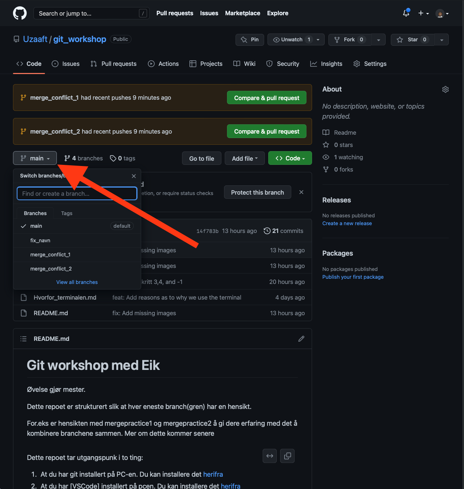

De branchene ser slik ut:

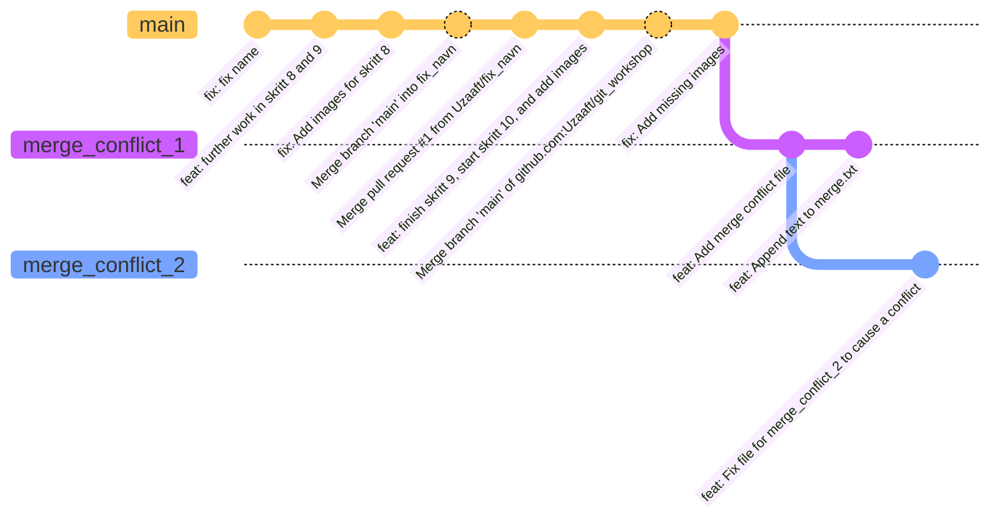
```mermaid
%%{init: { 'logLevel': 'debug', 'theme': 'base', 'gitGraph': {'rotateCommitLabel': true}} }%%
gitGraph
  commit id: "fix: fix name"
  commit id: "feat: further work in skritt 8 and 9"
  commit id: "fix: Add images for skritt 8"
  commit id: "Merge branch 'main' into fix_navn"
  commit id: "Merge pull request #1 from Uzaaft/fix_navn"
  commit id: "feat: finish skritt 9, start skritt 10, and add images"
  commit id: "Merge branch 'main' of github.com:Uzaaft/git_workshop"
  commit id: "fix: Add missing images"
  branch merge_conflict_1
  commit id: "feat: Add merge conflict file"
  branch merge_conflict_2
  checkout merge_conflict_1
  commit id: "feat: Append text to merge.txt"
  checkout merge_conflict_2
  commit id: "feat: Fix file for merge_conflict_2 to cause a conflict"
```

# BONUS
## La oss lage oss pimpe opp profilen vår på github:
Github kan bli brukt som en CV for utviklere, og designere. 

Du kan legge ut eksempel prosjekter med kode, designprosjekter, og folk kan se hvor aktiv du er. 
For.eks: 

Her har vi brukeren min:
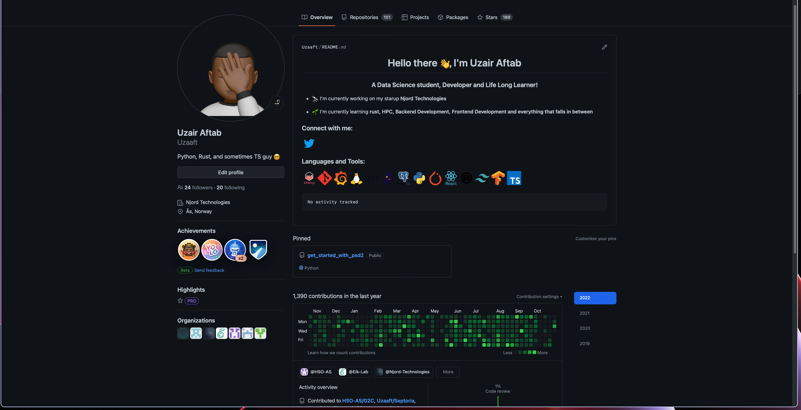
Fra denne kan vi finne ut av:
  - Hvilke språk liker han?
  - Hvilke verktøy kan han bruke?
  - Hvilke organisasjoner er han med i?
  - Hvor aktiv er han?(pekepinne)


[Inspirasjon for profiler](https://github.com/matiassingers/awesome-readme)  
[Fint startspunkt](https://github.com/othneildrew/Best-README-Template)