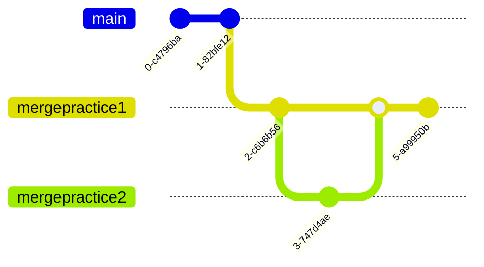

# Git workshop med Eik

Øvelse gjør mester.

Dette repoet er strukturert slik at hver eneste branch(gren) har en hensikt.

For.eks vil er hensikten med mergepractice1 og mergepractice2 å gi dere erfaring med det å kombinere branchene sammen.



Dette repoet tar utgangspunk i to ting:

1. At du har git installert på PC-en. Du kan installere det [herifra](https://git-scm.com)
2. At du har [VSCode] installert på pcen. Du kan installere det [herifra](https://code.visualstudio.com)

## Skritt 0: Lag en github bruker

- Gå til [Github](https://github.com).
- Lag en bruker og log inn på github.
- Pass på at du kan kommunisere med Github på PC-en din. Følg [denne guiden her](https://docs.github.com/en/authentication/connecting-to-github-with-ssh)
- På høyre siden av skjermen deres skal dere se en grønn knapp som sier `New`. Klikk på den.
- Gi det repoet et navn. For.eks `Learning git`
- Pass på at `Initialize this repository with a README` IKKE er huket av.

## Skritt 1: Sette opp github repoet på PC-en.

- Opprett en mappe kalt `mittProsjekt`.
- Gå inn i den mappen i VSCode.

* Trykk på `CTRL+SHIFT+P` og søk etter terminalen(skriv `create new terminal` i søkefeltet)

- I terminalvinduet, gå til mappen du lagde(Hvis den ikke åpner opp i samme mappe)[Hvorfor terminalen?](https://github.com/Uzaaft/git_workshop/blob/main/Hvorfor_terminalen.md)
- Kjør `git init`.
  - <details>
    <summary> Hva skjedde nå? </summary>
    <br />
    Du har nettopp fortalt datamaskinen din at du vil at git skal se på `myProject`-mappen og holde styr på eventuelle endringer. Dette lar oss også kjøre git-kommandoer inne i mappen. (Advarsel: Vær veldig forsiktig med å sørge for at du er i riktig katalog når du kjører `git init`!)
    </details>
- Kjør git remote add origin [SETT INN GITHUB URL-en INN HER]. Du kan få URL-en din ved å gå til repotet du har laget tidligere i nettleseren din og kopiere adressen. Se bilde under for eksempel.
  
  <br/>
  - <details>
    <summary>Hva skjedde nå? </summary>
    <br/>
    I utgangspunktet forteller vi datamaskinen vår "Hei, jeg opprettet denne repoen på GitHub, så når jeg 'pusher', vil jeg at koden min skal gå til denne adressen." Nå hver gang du kjører `git push origin master`, vet datamaskinen din at origin peker på repoen du har laget på GitHub, og den skyver endringene dine dit.
    <br/>
    (Hvis du ved et uhell initialiserte repoet ditt med en README, må du gjøre en git pull origin master først - for å få README-filen på datamaskinen din - før du kan trykke. )
    </details>

# Skritt 2: Legge til filer

Vi skal nå legge til en fil, og sende/lagre den til Github.

- Først, lag en fil i VSCode som heter README.md
- Skriv navnet ditt i filen.
- Gå inn i terminalen din, og kjør kommandoen under, der `FILNAVN er navnet på filen`:

```bash
git add <FILNAVN>
```

- Hva tror dere skjedde nå?

# Skritt 2.5: Beskrive hva vi har gjort.

Når man bruker git, og eventuelle nettsider for å håndtere Git([Github](www.github.com), [Gitlab](www.gitlab.com), [Bitbucket](https://bitbucket.org/) ), så burde man anta at noen andre kommer til å se koden din, og loggen over endringer man har gjort. For eksempel ser en git graf fra Njord Technologies sånn ut:


Her ser man en oversiktlig og fin graf der hver eneste commit(See på commit som et lagrings punkt, eller checkpoint).
Hver commit har en commit-melding, som er et liten tekst som forklarer hva commiten består av. En standarisert måte å skrive disse meldingene på kan [finnes her](https://www.conventionalcommits.org/en/v1.0.0/), men under finner du en TL;DR:
Endringene som en commit beskriver kan gruppes i for.eks:

- fix: En commit av typen `fix` som retter på en feil i koden/prosjektet.
- feat: En commit av typen `feat` som legger til en ny egenskap/feature i koden/prosjektet.
- BREAKING CHANGE, eller fix!/feat!: En commit som endrer på koden ved å enten rette på noe, eller legger til en ny egenskap/feature, og som fører ikke er bakover compatibel.
